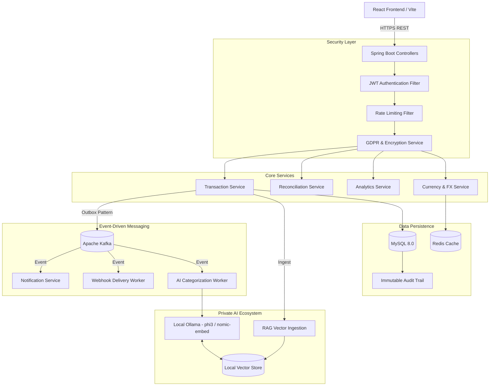

# FinSight Architecture & Technical Design

FinSight is a modern, enterprise-grade Spring Boot application utilizing a distributed event-driven microservices architecture via Kafka, local machine learning models, and comprehensive security layers.

---

## 1. High-Level Architecture Diagram

---

## 2. Core Architectural Patterns

### Event-Driven Messaging (The Outbox Pattern)
Instead of directly calling external services or sending emails during a web request (which can cause slow response times or data loss if the network fails), FinSight utilizes **Apache Kafka** paired with the **Transactional Outbox Pattern**.
- **How it works**: When a user creates a transaction, an event is written to an `outbox` table in the exact same database transaction as the business entity. 
- **Delivery**: A background poller reads the outbox and publishes to Kafka topics (`reconciliation.events`, `notification.events`).
- **Benefit**: Guarantees at-least-once message delivery. If the database commit succeeds but Kafka is down, the message is not lost.

### Private RAG & Air-Gapped AI
FinSight explicitly rejects the use of third-party APIs (like OpenAI) to ensure 100% data privacy for financial records.
- **RAG Implementation**: Transactions are continuously embedded using `nomic-embed-text` into a local Spring AI Vector Store.
- **Sandboxing**: Similarity searches (`SearchRequest`) strictly filter vectors by `userId` to ensure data isolation.
- **Concurrency**: Asynchronous AI tasks (like auto-categorizing a transaction) are wrapped in `TransactionSynchronizationManager.registerSynchronization` to prevent race conditions where the AI tries to read a transaction before the database has fully committed it.

### Telegram Bot Integration (Long Polling & Scheduling)
FinSight includes a deeply integrated Telegram bot built via `telegrambots-spring-boot-starter`.
- **Linking Protocol**: Users generate a secure 6-digit code in the UI which is verified when they message the bot, linking their `TelegramChatId` to their FinSight user account.
- **Long Polling**: The bot securely listens for incoming Telegram messages without requiring inbound port forwarding (perfect for local containerized deployment) and pipes queries directly to the internal `AiService`.
- **Scheduled Cron Jobs**: `@Scheduled(cron = "0 0 10 * * SUN")` automatically queries the database every Sunday morning to push proactive weekly summaries to all linked users.

### Circuit Breaking & Resilience
Financial systems must integrate with external banking or exchange rate APIs, which are notoriously unreliable. FinSight uses **Resilience4j**.
- **Circuit Breaker**: If an external FX API fails 50% of the time, the circuit "opens" to prevent cascading timeouts, falling back to stale Redis cache data.
- **Rate Limiter**: Caps external requests to prevent our IP from being banned by third-party data providers.

### Cryptography & GDPR Compliance
- **Data at Rest**: Sensitive personally identifiable information (PII) is encrypted at the database level using **Jasypt** (AES-256).
- **Audit Trails**: Uses Hibernate Envers and custom interceptors to maintain an immutable log of every CRUD operation (`transaction_audit_log`), storing the `old_value`, `new_value`, and the `principal` who made the change.
- **Data Portability**: Full GDPR workflows allowing users to export their data as JSON/CSV or issue "Right to be Forgotten" account deletion requests.

---

## 3. Tech Stack Deep Dive

### Backend
- **Framework**: Java 17 LTS, Spring Boot 3.5.x
- **Persistence**: Spring Data JPA, Hibernate 6, Flyway Migrations
- **Messaging**: Spring Kafka, Zookeeper
- **AI**: Spring AI, Local Ollama Container
- **Security**: JJWT (Stateless Tokens), Jasypt (Encryption)
- **Observability**: Spring Boot Actuator, Logstash/ELK

### Frontend
- **Framework**: React 18, TypeScript 5.6
- **Build System**: Vite 6.0
- **Styling**: Tailwind CSS
- **Visualization**: Recharts

### Infrastructure
- **Containerization**: Docker, Docker Compose
- **Databases**: MySQL 8.0, Redis 7 Alpine
- **Deployment Targets**: AWS ECS / Fargate (Terraform scripts included)
